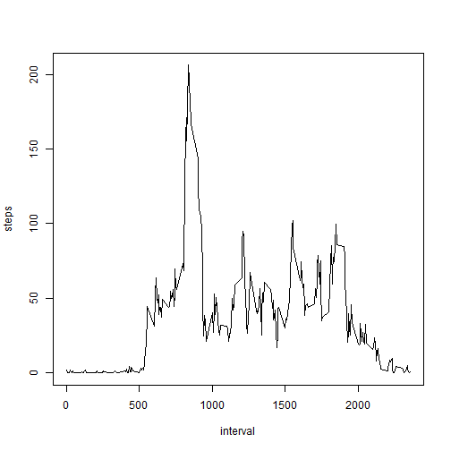

---
<<<<<<< HEAD
title: "RepData assesment1"
author: "kessoku"
date: "Monday, December 08, 2014"
output: html_document
---

Loading and preprocessing the data

```r
data <- read.csv("./repdata-data-activity/activity.csv")
```

the plot of total number of steps taken each day is

```r
library(ggplot2)
data.nonNA <- data[ which( is.na( data[,"steps"] ) == FALSE ), ]

steps.by.date <- tapply(data.nonNA$steps, data.nonNA$date, sum)
ggplot( data.frame(steps.by.date), aes(steps.by.date)) + geom_histogram()
```

```
## stat_bin: binwidth defaulted to range/30. Use 'binwidth = x' to adjust this.
```

 

the mean and median total number of steps taken per day are

```r
tapply(data.nonNA$steps, data.nonNA$date, mean)
```

```
## 2012-10-01 2012-10-02 2012-10-03 2012-10-04 2012-10-05 2012-10-06 
##         NA     0.4375    39.4167    42.0694    46.1597    53.5417 
## 2012-10-07 2012-10-08 2012-10-09 2012-10-10 2012-10-11 2012-10-12 
##    38.2465         NA    44.4826    34.3750    35.7778    60.3542 
## 2012-10-13 2012-10-14 2012-10-15 2012-10-16 2012-10-17 2012-10-18 
##    43.1458    52.4236    35.2049    52.3750    46.7083    34.9167 
## 2012-10-19 2012-10-20 2012-10-21 2012-10-22 2012-10-23 2012-10-24 
##    41.0729    36.0938    30.6285    46.7361    30.9653    29.0104 
## 2012-10-25 2012-10-26 2012-10-27 2012-10-28 2012-10-29 2012-10-30 
##     8.6528    23.5347    35.1354    39.7847    17.4236    34.0938 
## 2012-10-31 2012-11-01 2012-11-02 2012-11-03 2012-11-04 2012-11-05 
##    53.5208         NA    36.8056    36.7049         NA    36.2465 
## 2012-11-06 2012-11-07 2012-11-08 2012-11-09 2012-11-10 2012-11-11 
##    28.9375    44.7326    11.1771         NA         NA    43.7778 
## 2012-11-12 2012-11-13 2012-11-14 2012-11-15 2012-11-16 2012-11-17 
##    37.3785    25.4722         NA     0.1424    18.8924    49.7882 
## 2012-11-18 2012-11-19 2012-11-20 2012-11-21 2012-11-22 2012-11-23 
##    52.4653    30.6979    15.5278    44.3993    70.9271    73.5903 
## 2012-11-24 2012-11-25 2012-11-26 2012-11-27 2012-11-28 2012-11-29 
##    50.2708    41.0903    38.7569    47.3819    35.3576    24.4688 
## 2012-11-30 
##         NA
```

```r
tapply(data.nonNA$steps, data.nonNA$date, median) 
```

```
## 2012-10-01 2012-10-02 2012-10-03 2012-10-04 2012-10-05 2012-10-06 
##         NA          0          0          0          0          0 
## 2012-10-07 2012-10-08 2012-10-09 2012-10-10 2012-10-11 2012-10-12 
##          0         NA          0          0          0          0 
## 2012-10-13 2012-10-14 2012-10-15 2012-10-16 2012-10-17 2012-10-18 
##          0          0          0          0          0          0 
## 2012-10-19 2012-10-20 2012-10-21 2012-10-22 2012-10-23 2012-10-24 
##          0          0          0          0          0          0 
## 2012-10-25 2012-10-26 2012-10-27 2012-10-28 2012-10-29 2012-10-30 
##          0          0          0          0          0          0 
## 2012-10-31 2012-11-01 2012-11-02 2012-11-03 2012-11-04 2012-11-05 
##          0         NA          0          0         NA          0 
## 2012-11-06 2012-11-07 2012-11-08 2012-11-09 2012-11-10 2012-11-11 
##          0          0          0         NA         NA          0 
## 2012-11-12 2012-11-13 2012-11-14 2012-11-15 2012-11-16 2012-11-17 
##          0          0         NA          0          0          0 
## 2012-11-18 2012-11-19 2012-11-20 2012-11-21 2012-11-22 2012-11-23 
##          0          0          0          0          0          0 
## 2012-11-24 2012-11-25 2012-11-26 2012-11-27 2012-11-28 2012-11-29 
##          0          0          0          0          0          0 
## 2012-11-30 
##         NA
```

the average daily activity pattern is 

```r
intSteps.per.date <- tapply(data.nonNA$steps, data.nonNA$interval, mean)
plot( x=names(intSteps.per.date), y=intSteps.per.date, type="l", xlab="interval", ylab="steps")
```

 

the maximum number of steps is 

```r
max(intSteps.per.date)
```

```
## [1] 206.2
```

```r
names( intSteps.per.date[which( intSteps.per.date==max(intSteps.per.date) )] )
```

```
## [1] "835"
```

the num. of missing values is 

```r
sum( is.na( data$steps ) == TRUE )
```

```
## [1] 2304
```

the plot of dataset with the missing data filled in is 

```r
data.imputeNA <- data
NA.row.index <- which( is.na( data.imputeNA$steps ) == TRUE )
data.imputeNA[ NA.row.index, 1] <- 
  sapply( data.imputeNA[ NA.row.index, 3 ], 
          function(x){ intSteps.per.date[ which( names(intSteps.per.date) == x ) ]  } )

steps.by.date.2 <- tapply(data.imputeNA$steps, data.imputeNA$date, sum)
ggplot( data.frame(steps.by.date.2), aes(steps.by.date.2)) + geom_histogram()
```

```
## stat_bin: binwidth defaulted to range/30. Use 'binwidth = x' to adjust this.
```

 

the mean and median total number of steps taken per day are

```r
tapply(data.imputeNA$steps, data.imputeNA$date, mean)
```

```
## 2012-10-01 2012-10-02 2012-10-03 2012-10-04 2012-10-05 2012-10-06 
##    37.3826     0.4375    39.4167    42.0694    46.1597    53.5417 
## 2012-10-07 2012-10-08 2012-10-09 2012-10-10 2012-10-11 2012-10-12 
##    38.2465    37.3826    44.4826    34.3750    35.7778    60.3542 
## 2012-10-13 2012-10-14 2012-10-15 2012-10-16 2012-10-17 2012-10-18 
##    43.1458    52.4236    35.2049    52.3750    46.7083    34.9167 
## 2012-10-19 2012-10-20 2012-10-21 2012-10-22 2012-10-23 2012-10-24 
##    41.0729    36.0938    30.6285    46.7361    30.9653    29.0104 
## 2012-10-25 2012-10-26 2012-10-27 2012-10-28 2012-10-29 2012-10-30 
##     8.6528    23.5347    35.1354    39.7847    17.4236    34.0938 
## 2012-10-31 2012-11-01 2012-11-02 2012-11-03 2012-11-04 2012-11-05 
##    53.5208    37.3826    36.8056    36.7049    37.3826    36.2465 
## 2012-11-06 2012-11-07 2012-11-08 2012-11-09 2012-11-10 2012-11-11 
##    28.9375    44.7326    11.1771    37.3826    37.3826    43.7778 
## 2012-11-12 2012-11-13 2012-11-14 2012-11-15 2012-11-16 2012-11-17 
##    37.3785    25.4722    37.3826     0.1424    18.8924    49.7882 
## 2012-11-18 2012-11-19 2012-11-20 2012-11-21 2012-11-22 2012-11-23 
##    52.4653    30.6979    15.5278    44.3993    70.9271    73.5903 
## 2012-11-24 2012-11-25 2012-11-26 2012-11-27 2012-11-28 2012-11-29 
##    50.2708    41.0903    38.7569    47.3819    35.3576    24.4688 
## 2012-11-30 
##    37.3826
```

```r
tapply(data.imputeNA$steps, data.imputeNA$date, median) 
```

```
## 2012-10-01 2012-10-02 2012-10-03 2012-10-04 2012-10-05 2012-10-06 
##      34.11       0.00       0.00       0.00       0.00       0.00 
## 2012-10-07 2012-10-08 2012-10-09 2012-10-10 2012-10-11 2012-10-12 
##       0.00      34.11       0.00       0.00       0.00       0.00 
## 2012-10-13 2012-10-14 2012-10-15 2012-10-16 2012-10-17 2012-10-18 
##       0.00       0.00       0.00       0.00       0.00       0.00 
## 2012-10-19 2012-10-20 2012-10-21 2012-10-22 2012-10-23 2012-10-24 
##       0.00       0.00       0.00       0.00       0.00       0.00 
## 2012-10-25 2012-10-26 2012-10-27 2012-10-28 2012-10-29 2012-10-30 
##       0.00       0.00       0.00       0.00       0.00       0.00 
## 2012-10-31 2012-11-01 2012-11-02 2012-11-03 2012-11-04 2012-11-05 
##       0.00      34.11       0.00       0.00      34.11       0.00 
## 2012-11-06 2012-11-07 2012-11-08 2012-11-09 2012-11-10 2012-11-11 
##       0.00       0.00       0.00      34.11      34.11       0.00 
## 2012-11-12 2012-11-13 2012-11-14 2012-11-15 2012-11-16 2012-11-17 
##       0.00       0.00      34.11       0.00       0.00       0.00 
## 2012-11-18 2012-11-19 2012-11-20 2012-11-21 2012-11-22 2012-11-23 
##       0.00       0.00       0.00       0.00       0.00       0.00 
## 2012-11-24 2012-11-25 2012-11-26 2012-11-27 2012-11-28 2012-11-29 
##       0.00       0.00       0.00       0.00       0.00       0.00 
## 2012-11-30 
##      34.11
```


Are there differences in activity patterns between weekdays and weekends?

```r
weekday.end <- 
data.frame( sapply( weekdays( as.Date(data.imputeNA[,2])  ), 
                    function(day){ if(day %in% c("“y—j“ú","“ú—j“ú") ){ "weekend" }
                                   else{"weekday"} 
                                  } ) )

data.imputeNA.weekday <- data.imputeNA[which(weekday.end=="weekday"), ]
data.imputeNA.weekend <- data.imputeNA[which(weekday.end=="weekend"), ]

intSteps.per.weekday <- tapply(data.imputeNA.weekday$steps, 
                               data.imputeNA.weekday$interval, 
                               mean)
intSteps.per.weekend <- tapply(data.imputeNA.weekend$steps, 
                               data.imputeNA.weekend$interval, 
                               mean)
plot( x=names(intSteps.per.weekday), 
      y=intSteps.per.weekday, main="weekday",
      type="l", xlab="interval", ylab="steps")
```

 

```r
plot( x=names(intSteps.per.weekend), 
      y=intSteps.per.weekend, main="weekend",
      type="l", xlab="interval", ylab="steps")
```

 
